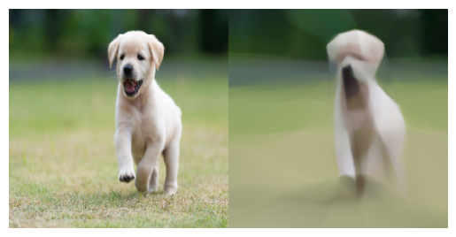
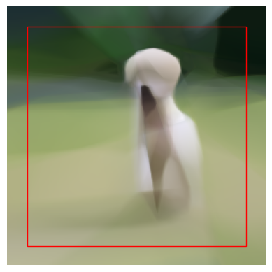
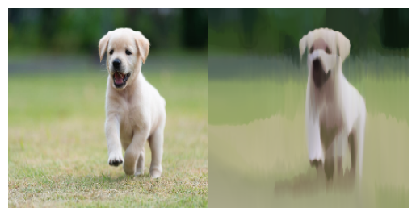

# Image Outpainting using Implicit Neural Representations(INR)

### Feedforward network-based implementation for learning the source image distribution.
### Results of the first implementation:
- Reported PSNR 23.003
- Ground truth(left) with the Reconstructed image (right):-

### Outpainted Image (20 pixels)
- The following is the model generated outpainted(20 pixels) image for the given source image.

### Feedforward network +  Positional Encoding-based implementation for learning the source image distribution.
- Reported PSNR 24.389
- Ground truth(left) with the improved Reconstructed image(right):--

## References :-
- [Fourier Features Let Networks Learn
High-Frequency Functions in Low-Dimensional Domains](https://arxiv.org/pdf/2006.10739.pdf)
